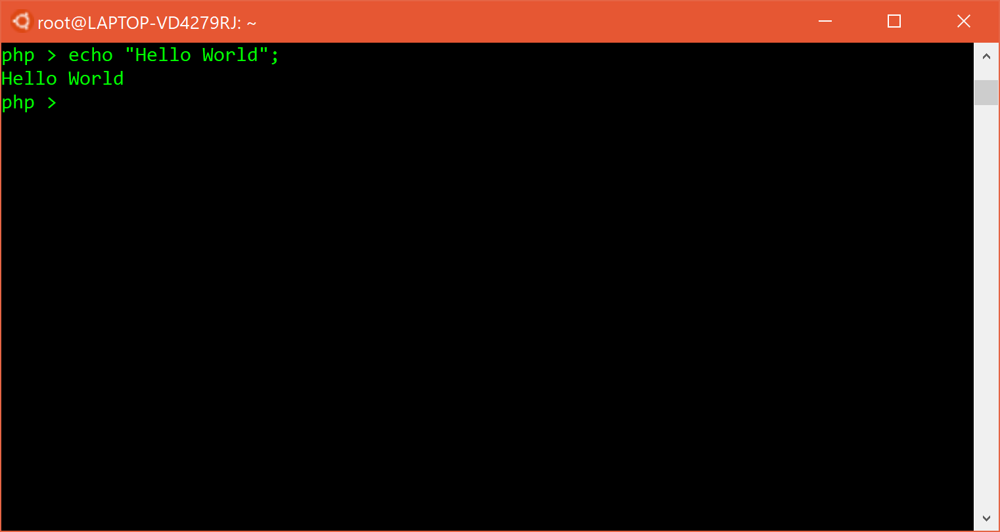
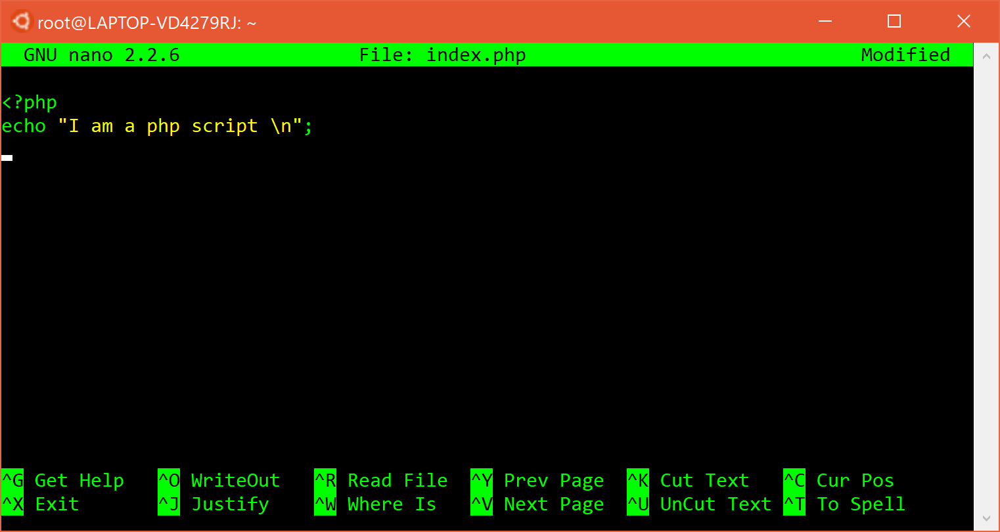
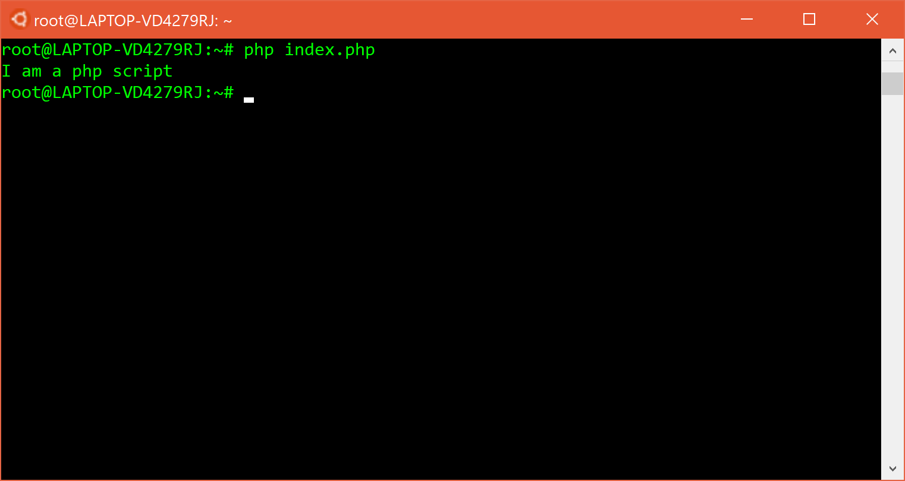
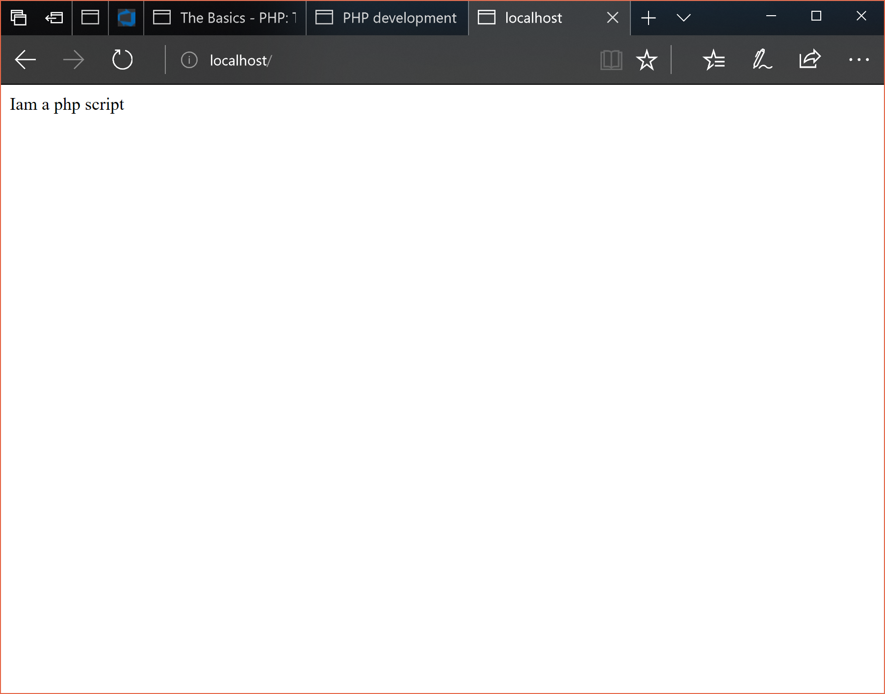

# Setting Up

## Installing PHP

PHP as a language is heavily inspired by Bash scripts
and functionality associated with UNIX.

This means that despite me working on a Windows machine,
I highly recommend that you use the Ubuntu sub-system on
Windows 10 and download PHP on your Ubuntu Bash shell.

[Josh Lockhart has an excellent article](https://joshlockhart.com/php-development-with-the-windows-subsystem-for-linux.html)
on installing PHP 7 on the Linux Subsystem. It is worth
noting that I say PHP 7 as the first mistake you can 
make when using PHP is using anything that is older than
it needs to be.

The article details a long install command, you can
get away with the following;

```sh
sudo add-apt-repository ppa:ondrej/php
sudo apt-get update
sudo apt-get install php7.1 -y
```

Once that's done, you can check your php version with `php -v` the output something like;

```sh
PHP 7.1.12-2+ubuntu14.04.1+deb.sury.org+2 (cli) (built: Dec  7 2017 21:07:44) ( NTS )
Copyright (c) 1997-2017 The PHP Group
Zend Engine v3.1.0, Copyright (c) 1998-2017 Zend Technologies
    with Zend OPcache v7.1.12-2+ubuntu14.04.1+deb.sury.org+2, Copyright (c) 1999-2017, by Zend Technologies
```

## Running PHP

As I said, this tutorial will focus on both using PHP as
a way of running scripts and create web applications.

### PHP Interactive

PHP surprisingly does have a REPL (Read Evaluate Print 
Loop) which allows you to execute code interactively. 

We won't look into the REPL too much, but let's give it
a quick crack and make it say hello world.

To open up _Interactive Mode_ just type;

```sh
php -a
```

Then type (**with the semi-colon**);

```php
echo "Hello World";
```



Look at you! You just ran your first bit of PHP! Now press
Ctrl + D and never touch the interactive window again as
it does literally nothing for you as a PHP programmer.

### Our first PHP Script

PHP is a scripting language, this means it's got uses
outside of web applications. Is this a good thing? That's
debated but it's still a better application than 
the interactive shell. Whilst you don't have to do this, let's write our first script in GNU Nano. Type the 
following command into Bash;

```sh
nano index.php
```

And enter the following into your PHP file;

```php
<?php
echo "I am a php script \n";
?>
```




Save and exit with Ctrl + X and lets review the script quickly;

- `<?php` signifies the start of a PHP block, `?>` closes the block
    - The `?>` is optional in a Pure PHP script (no HTML, just PHP) however include it for now as it'll teach you good habits
- The `echo` keyword will print a string to the output
    - This works for both the command line and a webapp
    - It takes a string surrounded by `""`
    - I added the `\n` (newline character so that there was a break in the console output, it's optional)
- ALWAYS FINISH YOUR LINES WITH `;` OTHERWISE YOUR PROGRAM WILL BREAK AND PHP DOES A SHIT JOB TELLING YOU THIS

Once you've saved the script, run it as you would with
any other scripting language;

```bash
php index.php
```



Look at you! Great stuff, that's your first proper PHP
script. Run it as many times as you want, edit the strings
if you feel adventurous, it's yours!

### PHP as a Webapp

Here's the cool part. So the thing about PHP was for
years it took a while to get first started as you needed
to download a server, configure the server, make sure 
the right stuff was downloaded and the right ports
were open and then you were ready to write your hello
world app. This is offputting, especially when you're just
learning and having to literally setup a full Apache
server that if you use WAMP/LAMP/XAMP stack will come
with a bunch of other stuff such as MySQL/MariaDb, 
MongoDb and even Perl (a different scripting language 
entirely). If you need this stuff, use XAMPP as it's great
for everything you need but for us we can use the **built in PHP server**.

To run your `index.php` file in browser, run the following
in the same directory as the file;

```bash
php -S localhost:80
```

Note;

- Capital S, there is a difference
- Running on `localhost`, port `80`
    - This can be changed if you wish, just stuck to conventions

Let's go to http://localhost:80 and have a look at our
site;



It looks like garbage, but hey it's a start! Don't forget
that because PHP is a scripting language you can 
change your file, save it and reload the page with the new
changes (just make sure you leave the server open).