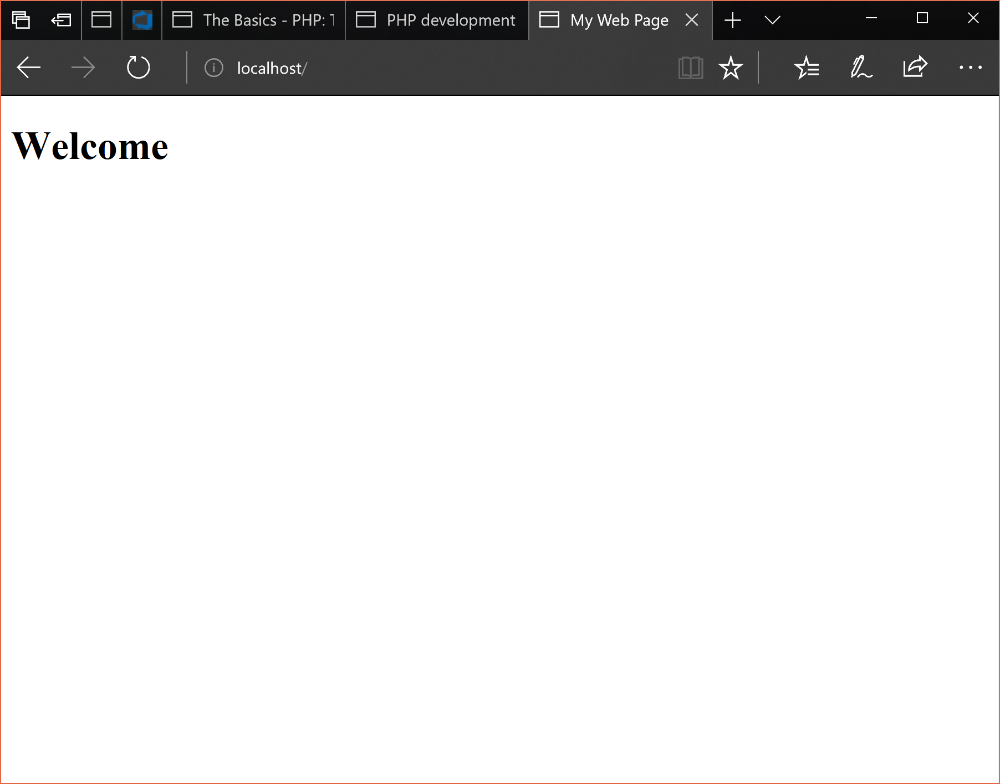

# A Basic Webpage

## A Good Template

Okay so let's make some cool stuff. 
Every chapter of this I am writing the source code as I
write this markdown. This means the `index.php` that you
see is the same one I used so no complaints if it doesn't
work.

PHP assumes you know basic HTML when you build pages
with it. This means that structured PHP pages
need to be structured HTML pages.

If you have VS Code (if you don't, get it) or an Emmet
powered text editor you can produce the following template
using the `html:5` shortcut

```html
<!DOCTYPE html>
<html lang="en">
<head>
    <meta charset="UTF-8">
    <meta name="viewport" content="width=device-width, initial-scale=1.0">
    <meta http-equiv="X-UA-Compatible" content="ie=edge">
    <title>Document</title>
</head>
<body>

</body>
</html>
```

Let's modify this to have a block for PHP;

```php
<!DOCTYPE html>
<html lang="en">
<head>
    <meta charset="UTF-8">
    <meta name="viewport" content="width=device-width, initial-scale=1.0">
    <meta http-equiv="X-UA-Compatible" content="ie=edge">
    <title>Document</title>
</head>
<body>
    <?php
    
    ?>
</body>
</html>
```

PHP is a language that can be garbage, look really shit and above all be a bitch to maintain. So from
now one we're going to ensure our PHP uses this template
and that **most** of our PHP code is in that block. 

You'll get what this means soon, if you're unsure about 
HTML as well as PHP [watch this video](https://www.youtube.com/watch?v=bWPMSSsVdPk) as it teaches 
basic HTML concepts quickly.

## Let's make a site

Open up a new folder and create an `index.php` file inside
it; run your server in that directory.

If you're running a Powershell window in your current 
directory, this command will get your server running 
without having to open Bash (the output is piped from Bash into your Powershell window, it's helpful);

```ps
bash -c "sudo php -S localhost:80"
```

Going to that address again will give you a blank page
titled _"Document"_. Note that the reason I've called 
my files `index.php` is so that we don't need to manually
navigate to them (index as a filename is the standard for 
your app's homepage).

### Echoing a heading

Let's change the value between our `<title>` tags to 
something nice, and then change our body content to
look like;

```php
<body>
    <?php
        echo "<h1>Welcome</h1>";
    ?>
</body>
```

Refresh the page and wow!



What a page! That's not very dynamic though so
let's modify it to make full use of what PHP can offer.

```php
<body>
    <?php
        $name = "Alex";
        echo "<h1>Welcome $name</h1>";
    ?>
</body>
```

Refreshing you should see a minor change.

What we just introduced was a variable called `$name`.

Variables are containers for our data, in PHP a variable
always has a `$` in front of it and is assigned with
the `=` operator.

When you use a string with `"` surrounding it, using the 
dollar sign can be used to interpolate (insert) a variable
within another variable.

### Types of data in PHP.

I've been talking a lot about strings but what is a string?
A string is a set of characters, denoted by the `"` or `'`
surrounding them.

They can be defined like

```php
$word = "word"; // with double quotes
$anotherWord = 'with single quotes'; // with single quotes
$wordWithinAWord = "The first word was $word"; // double quotes with string interpolation
```

Those `//` comments aren't read by PHP, you can use those for taking notes in your code!

We also have numbers such as integers (whole numbers) and floating point/decimal numbers (with decimal points).

To define numbers, just drop the quotes;

```php
$number = 1;
$anotherNumber = 2;
$aDecimal = 3.14;
```

You can echo numbers;

```php
echo 1;
```

And perform maths on them;

```php
$num1 = 1;
$num2 = 2;
$num3 = $num1 + $num2;
```

### Learn more basics

Learn more basics [here](www.phptherightway.com/pages/The-Basics.html), it's a much better explanation than I can give.

### When do we need PHP?

This is a big question, take the first example;

```php
<body>
    <?php
        echo "<h1>Welcome</h1>";
    ?>
</body>
```

The funny part about this is that we didn't need PHP;
the same output could be achieved using straight HTML;

```html
<body>
    <h1>Welcome</h1>
</body>
```

Already that looks cleaner, easier to read too.

PHP can be a good thing but it's better if we use it as sparingly as we can in our pages for readability.

What about the name example? We definitely can't do
that in pure HTML as it's dynamic, it needs the `$name` 
variable to work.

We need to think about things like this if we are to
write nice PHP code. What I like to do is bulk my HTML
and PHP code so that we don't get what is called 
spaghetti code. For example, if we wanted to have both
a welcome and a reference to name we could write this;

```php
<body>
    <h1>Welcome</h1>
    <?php
        $name = "Alex";
        echo "<h2>My name is $name</h2>";
    ?>
</body>
```


See how clean that is, we have the static code of
welcome in the plain HTML and the dynamic code in
the PHP. The worst part about this is actually
that it could be cleaner. Remember how I said
before that we should keep most our
PHP code in one block? Well this is an exception in a way
as what I like to do is define my
variables and my functionality **before** anything and
then echo them when I need them. Like so...

```php
<body>
    <?php
        $name = "Alex";
    ?>

    <h1>Welcome</h1>
    <?php echo "<h2>My name is $name</h2>"; ?>
</body>
```

Whilst there is a nicer separation of the data and the UI,
we can make this even shorter with the _"Short Open Tag"_.

The short open tag allows you to do a quick echo of a 
variable without needing all the semicolons and such that 
you usually require. The syntax for it is `<?= $someVar ?>`
And it can be used in our example like so;

```php
<body>
    <?php
        $name = "Alex";
    ?>

    <h1>Welcome</h1>
    <h2>My name is <?= $name ?></h2>
</body>
```

Look how clean that is! We haven't echoed out any HTML 
tags and all our data is defined at the start of our page.

Decisions like this are what make good PHP code
and if you make sure there is some consistency in your
codes structure you're bound to write PHP
pages that don't suck.

Play around with this page more before moving onto part 3,
there's so much you can try that you won't get bored for a bit at least.