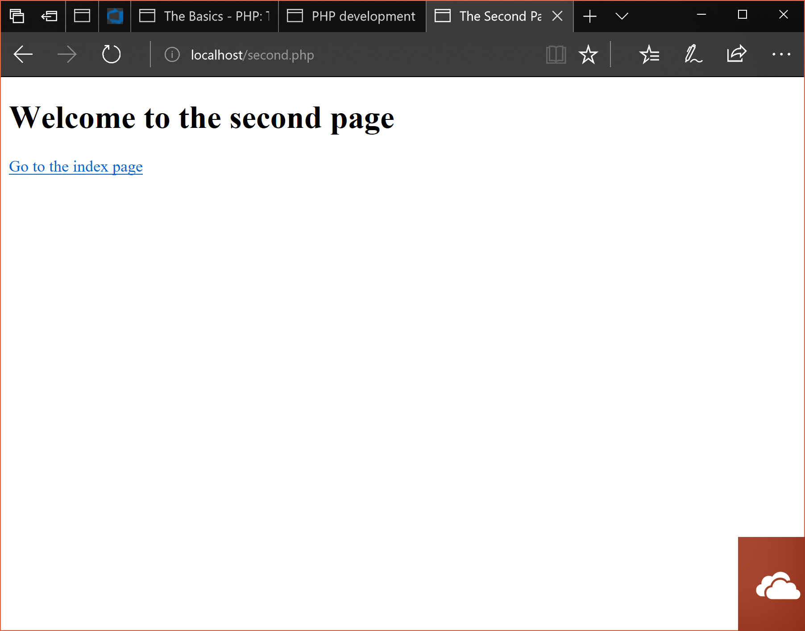

# Taking Input

## Moving across pages.

Not much point having a single page for our web app right?

PHP links are as easy as HTML links, for the first part of our input
taking we need to make a second page to pass stuff to. 

Let's start this part by making a new folder, starting our server in
it and adding an `index.php` that looks like so;

```php
<!DOCTYPE html>
<html lang="en">

<head>
  <meta charset="UTF-8">
  <meta name="viewport" content="width=device-width, initial-scale=1.0">
  <meta http-equiv="X-UA-Compatible" content="ie=edge">
  <title>My Web Page</title>
</head>

<body>
  <?php
  ?>
    <h1>Welcome</h1>
    <a href="second.php">Go to the second page</a>
</body>

</html>
```

Create a second PHP file in the same directory, call it `second.php` and then add
this code;

```php
<!DOCTYPE html>
<html lang="en">

<head>
  <meta charset="UTF-8">
  <meta name="viewport" content="width=device-width, initial-scale=1.0">
  <meta http-equiv="X-UA-Compatible" content="ie=edge">
  <title>The Second Page</title>
</head>

<body>
  <?php
  ?>
    <h1>Welcome to the second page</h1>
    <a href="index.php">Go to the index page</a>
</body>

</html>
```

Load up your page on the server and enjoy the ride;




Using the `a` tag we can create links to other pages on our site and on the internet too. Just like normal HTML this is easy, but using PHP we can provide some behaviour that would not be possible with plain HTML.

## Reading a text file

PHP (as with every language) has a bunch of built in 
functions out of the box to help create web apps.

One that I love is `file_get_contents`, which allows
you to read any file to a string variable.

### Hold on what is a function?

Before we get into using a function, let's make our own
quickly.

A function is a series of steps you define in your code 
that can be reused throughout the code. This allows
your code to be clean and easy to reuse, it's just
good programming.

Let's make a simple function that echos hello;

```php
function sayHello()
{
    echo "Hello";
}
```

Note;

- The usage of the `function` keyword
- The curly brackets to show the the function block
    - Everything in those brackets is what gets ran
- The round brackets after the name of the function.

To call sayHello we just go...

```php
sayHello();
```

Really simple, what if we wanted to provide some data to
a function;

```php
/// Declaration
function sayHelloWithName($name)
{
    echo "Hello $name";
}

// Usage
sayHelloWithName("Alex"); // echos "Hello Alex";
```

These functions are known as procedures, they do things but don't give anything back. 
When a function `return`s something it can be used to 
assign to a variable. That's what the `file_get_contents`
does; it reads a file and returns its contents to be used by the PHP.

If we wanted to make a function that returned the greeting
rather than print it, you'd go;

```php
function sayHelloReturn($name)
{
    return "Hello $name";
}

$greeting = sayHelloReturn("Alex");
echo $greeting; // Hello Alex
```

It's a bit of a confusing concept but if you want to 
learn more [read this](https://www.w3schools.com/php/php_functions.asp) (yes I know it's W3 schools but it's alright).

### Reading a file

Back to our program, let's display the contents of a file.

In our project's directory, add a file called `story.txt`.
Write something in that file and save it.

In our PHP code for our first page,
edit the body to look like the following:

```php
<body>
  <?php
    $story = file_get_contents("story.txt");
  ?>
    <h1>Welcome</h1>
    <a href="second.php">Go to the second page</a>
    <p><?= $story ?></p>
</body>
```
Refresh your index page and would you look at that! If you
edit the .txt file it will change the page on reload.

This works for anything that is plain text, so for example
if you wrote HTML markup to the .txt it would be formatted
on print.

**TBC**